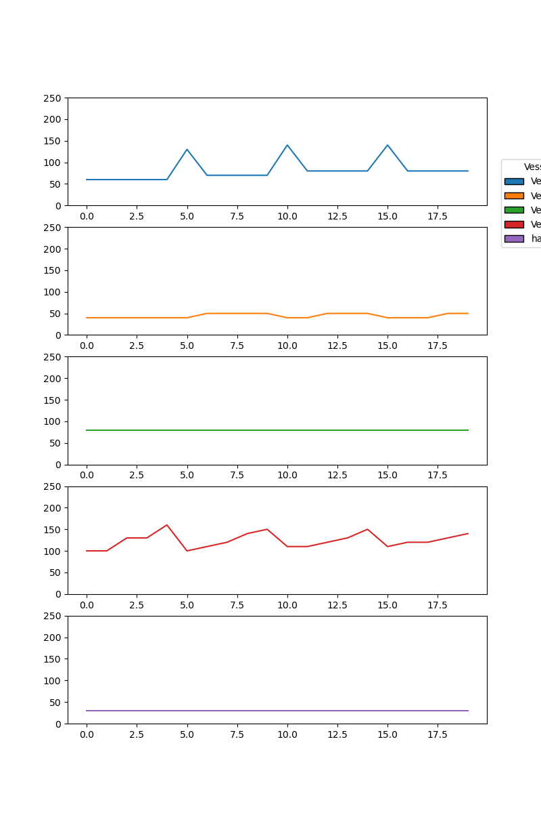
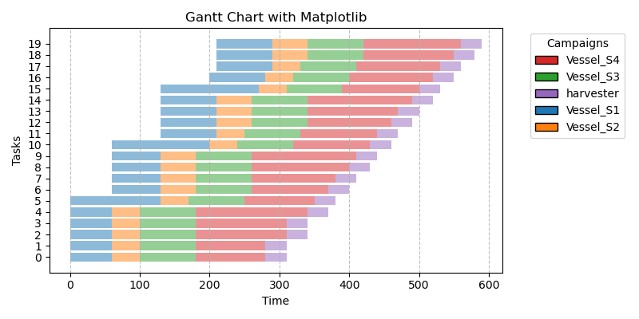
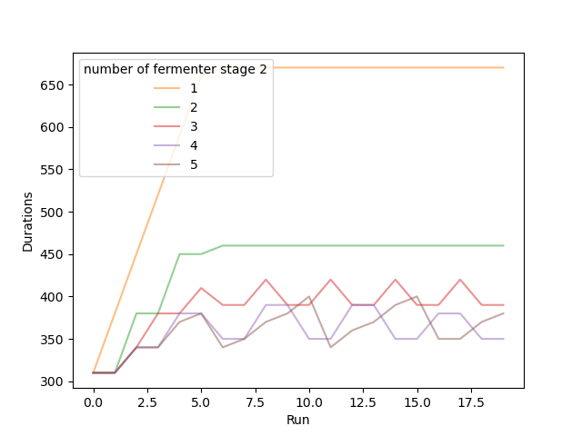

# Open Pharma Twin

>This is a draft currently

This repo is my own toy Pharma factory simulator.

# Content:
Simulation of toy Plant with monitors

## Vessel process durations - Time Bottleneck

## Gant Chart for timing 

## Comparing different factory layouts
